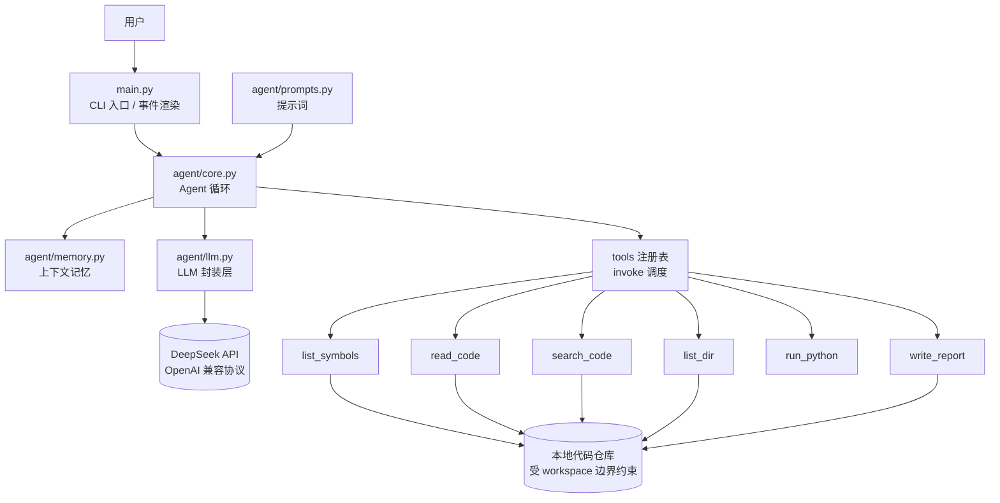
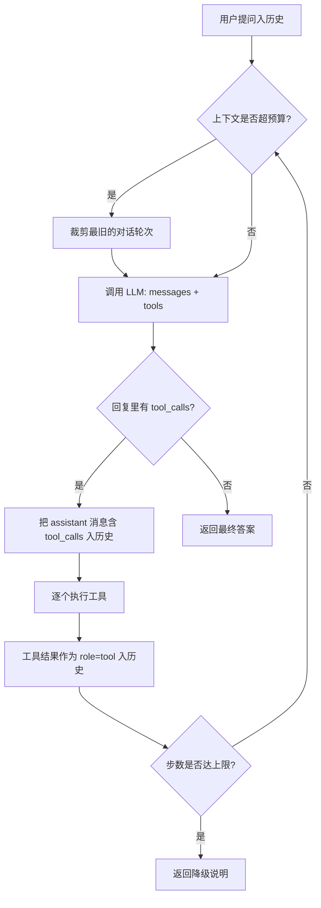

# 设计文档（Design.md）

> 项目：代码解释 Agent · 软件工程 Homework 1
> 配套文件：[README.md](README.md)（安装与使用）
> 本文档对应评分点：**Agent 架构 30%** 与 **文档 10%**

---

## 1. 作业目标与需求映射

| 作业要求 | 本项目实现 | 位置 |
|---------|-----------|------|
| 基本 Agent 循环：输入 → 推理 → 工具调用 → 输出 | 显式实现的 `while` 循环，每步可见可调试 | `agent/core.py: CodeExplainAgent.ask()` |
| 支持至少一种工具 | 6 个工具（读取/结构/检索/目录/执行/报告） | `tools/` |
| 可通过命令行交互 | 交互模式 + 单次提问模式 + 6 个本地命令 | `main.py` |
| 使用 LLM 原生 API | DeepSeek OpenAI 兼容接口（不用 Agent 框架） | `agent/llm.py` |
| 支持上下文记忆 | 两级记忆：滑窗裁剪 + 会话落盘 | `agent/memory.py` |
| 错误处理与重试机制 | 分类重试 + 工具异常回传模型自纠 + 步数上限 | `agent/llm.py`、`agent/core.py` |
| 技术栈自由选择 | Python 3.12 + openai SDK，无框架依赖 | `requirements.txt` |

---

## 2. 总体架构



### 分层职责与依赖方向

```
main.py  ──依赖──▶  agent/core.py  ──依赖──▶  agent/llm.py  ──▶  外部 API
                          │
                          ├──依赖──▶  agent/memory.py    （纯内存/文件，无外部依赖）
                          ├──依赖──▶  agent/prompts.py   （纯字符串模板）
                          └──依赖──▶  tools/             （本地执行，无外部依赖）
```

**依赖是单向向下的**：底层模块不知道上层存在。带来三个具体好处：

1. `tools/` 里的工具可以在没有 API Key、没有网络的情况下单独测试（`python main.py --check` 就是这么做的）。
2. `agent/core.py` 不知道"终端"的存在，因此换成 Web 界面或自动化测试时，**零改动**。
3. `agent/llm.py` 是唯一与外部服务通信的模块，更换模型厂商只需改 `config.py` 中的一张表。

---

## 3. 核心：Agent 循环

### 3.1 循环流程



### 3.2 关键实现细节

**（1）assistant 消息必须原样回填**

模型请求调用工具时，返回的消息里带 `tool_calls` 字段。按 OpenAI 兼容协议，后续每条 `role=tool` 的结果消息都必须能对应上一个 `tool_call_id`，否则接口直接报 400。因此代码保留了**服务端返回的原始 `arguments` 字符串**（`raw_arguments`），而不是重新序列化 `dict`：

```python
assistant_message["tool_calls"] = [{
    "id": c.id, "type": "function",
    "function": {"name": c.name, "arguments": c.raw_arguments or "{}"},   # 原样字符串
} for c in tool_calls]
```

这是一个很容易踩的坑：重新 `json.dumps` 会改变键的顺序和空格，某些服务端会因此校验失败。

**（2）工具失败不抛异常，而是回传给模型**

`tools/invoke()` 捕获所有异常并转成可读文本。

```
模型调用 read_code(path="utils.py")  →  [错误] 文件不存在：utils.py。
模型看到错误 →  改用 list_dir(".") 确认实际路径 →  重新读取成功
```

如果这里抛异常，整个 Agent 就崩了；回传错误则让模型有机会**自我纠正**。

**（3）三重防护，防止死循环与费用失控**

| 防护 | 值 | 作用 |
|------|-----|------|
| `max_steps` | 12（可调） | 单次提问最多 12 轮"推理+工具调用" |
| `MAX_TOOL_CALLS_PER_STEP` | 6 | 单轮最多执行 6 个工具（模型偶尔一次请求十几个） |
| `MAX_CHARS`（各工具内） | 6k–24k 字符 | 单个工具输出上限，防止一次读入撑爆上下文 |

达到步数上限时，**不抛异常**，而是返回一段可操作的说明（"建议把问题范围缩小到具体文件/函数"），保证用户始终能得到反馈。

---

## 4. 分层设计说明

### 4.1 配置层（`config.py`）—— 让模型可插拔

```python
PROVIDERS = {
    "deepseek": ProviderConfig(base_url="https://api.deepseek.com",
                               default_model="deepseek-flash",
                               supports_thinking=True,
                               thinking_extra_body={"thinking": {"type": "enabled"}}),
    "qwen":     ProviderConfig(base_url="https://dashscope.aliyuncs.com/compatible-mode/v1", ...),
    "glm":      ProviderConfig(base_url="https://open.bigmodel.cn/api/paas/v4", ...),
}
```

因为主流厂商都提供 OpenAI 兼容接口，**换模型 = 改一个环境变量**（`LLM_PROVIDER`），业务代码零改动。厂商专属参数（如 DeepSeek 的思考模式）通过 `extra_body` 透传，不污染通用逻辑。

配置读取遵循"真实环境变量 > `.env` 文件 > 代码默认值"的三级优先，并容忍拼写错误：未知的 provider 名会打印警告并回退到默认值，而不是让程序崩溃。

### 4.2 LLM 封装层（`agent/llm.py`）—— 把现实的不可靠收敛在一处

**分类重试策略**（重试判定见 `_is_retryable`）：

| 错误类型 | 是否重试 | 理由 |
|---------|---------|------|
| 429 限流 | ✅ | 等一会儿就好 |
| 5xx 服务端错误 | ✅ | 服务端瞬时故障 |
| 网络超时 / 连接中断 | ✅ | 网络抖动 |
| 401 鉴权失败 | ❌ | Key 错了，重试一百次也一样 |
| 400 参数错误 | ❌ | 请求本身有问题，重试无意义 |
| 余额不足 | ❌ | 需要用户操作 |

重试采用**指数退避 + 随机抖动**（`min(2^(n-1), 8) + rand(0, 0.6)` 秒）。加抖动的目的是避免多个请求同时重试，把限流打得更死。

`temperature=0.2`：代码解释要求稳定、可复现，不需要发散。同样的代码问两次应该得到基本一致的解释。

会话结束时输出 `usage_text()`，展示 token 用量与估算费用（按 DeepSeek 官方价目表），便于控制成本。

### 4.3 记忆层（`agent/memory.py`）—— 两级记忆

**短期记忆（工作记忆）**：`self.messages` 保存完整消息序列。风险是它会无限增长，因此有滑窗裁剪：

```
裁剪规则：
  · 永远保留第 0 条 system prompt
  · 永远保留最近 24 条消息
  · 从最旧处成组丢弃，且丢弃边界必须落在 user 消息上
  · 裁剪后插入一条 system 消息说明"已省略早期 N 条消息"
```

**边界必须落在 user 消息上**是关键：如果从中间切断，会留下"孤儿 tool 消息"（有 `role=tool` 但没有对应的 `tool_calls`），接口会直接 400。

**长期记忆**：`save()` / `load()` 把会话（含完整的工具调用轨迹）写入 `.agent_memory/*.json`。用途有两个：跨会话恢复上下文；以及作为写报告/复盘的素材（能回看 Agent 每一步调了什么工具）。

token 估算用"字符数 ÷ 2.0"的近似值，不引入 `tiktoken` 这类重依赖。目的是**量级控制**而非精确计费，这个精度完全够用。

### 4.4 提示词层（`agent/prompts.py`）—— Prompt 设计要点

对应作业"Prompt 设计"核心技术要点。四条设计原则：

**（1）显式给出工具使用策略，而不是让模型自己摸索**

```
1. 先建骨架，再精读：先 list_symbols 拿结构，再只读相关行区间
2. 跨文件问题要检索：必须用 search_code 找证据，不要凭函数名推测
3. 能验证就验证：行为不直观时用 run_python 跑一遍
4. 不要重复读同一内容
5. 读不到就如实说明
```

第 1 条是本项目控制成本的关键。实测"先建骨架 + 精读目标函数"相比"整个文件读进来"，token 消耗可以低一个量级。

**（2）固定输出结构，让结果可评测**

```
## 一句话概括
## 逐段解释    （每段标注行号区间，如 L12-L28）
## 关键点与易错处
## 潜在问题    （没有就写"未发现明显问题"，不许凑数）
## 建议补充的注释
```

强制"没有发现问题就明确写没有"，是为了**抑制模型为凑字数而编造问题**。

**（3）few-shot 示范"行动序列"而非"回答风格"**

示范的是工具调用的先后顺序（先 `list_symbols` → 再 `read_code` → 发现问题再 `search_code`/`run_python`），并明确标注"不是每题都要走完这 5 步，但**绝不能跳过看代码这一步凭空回答**"。这比单纯描述"你要仔细"有效得多。

**（4）注入行为准则，约束越权**

"只读不改"、"行号必须来自工具真实返回"、"不确定就说不确定"、"术语要用一句话解释"。这几条直接对应评分表的"功能完整性"与"代码质量"。

### 4.5 工具层（`tools/`）—— 能力边界

**设计模式：注册表 + 装饰器**

```python
@register({"type": "function", "function": {
    "name": "read_code",
    "description": "读取一个源码文件...",
    "parameters": {...},
}})
def read_code(path: str, start_line=None, end_line=None) -> str:
    ...
```

新增工具只需三步（写 handler → 写 schema → `@register`），Agent 自动获得该能力。`tools/loader.py` 显式列出所有工具模块，好处是"Agent 具备哪些能力"一目了然，评审时不用翻遍目录。

**schema 的 description 就是给模型的说明书**，它的质量直接决定模型能否正确调用。例如 `read_code` 的 description 里明确写了"文件很长时应先建骨架或分段精读"，这是把提示词战术直接写进工具契约里。

**（1）`list_symbols` —— 结构化理解的核心增量**

这是相对"把文件丢给模型"最主要的改进。Python 文件用 `ast` 精确解析，输出形如：

```
文件：demo/utils.py（解析方式：Python ast）
共 45 行，提取到 5 个条目
------------------------------------------------------------
IMPORTS (2): re, __future__.annotations
L8-12    clean_text(value: str) -> str   # 折叠连续空白并去掉首尾空格
L15-33   parse_age(value: object) -> int   # 把各种形态的年龄值转成 int
L36-52   normalize_record(record: dict) -> dict   # 把原始记录规范化
```

关键在于**同时给出名称、签名、docstring 摘要和精确行号区间**：模型据此就能判断"该读哪 15 行"，而不必把 3000 行全部读入。这既降成本，也让解释的定位精度显著提高。

非 Python 文件走正则粗提取分支（`_PATTERNS`），覆盖 JS/TS/Java/Go 等语言的常见声明形式——不追求语法精确，够用即可。

语法错误时返回 `[语法错误] 无法解析该 Python 文件：第 22 行 '(' was never closed`，而不是抛异常。

**（2）`read_code` —— 编码容错是必需的**

真实仓库经常混着 GBK 编码的中文注释，`open(encoding='utf-8')` 会直接抛 `UnicodeDecodeError`。这里按 `utf-8 → utf-8-sig → gbk → latin-1` 依次尝试（`demo/sample_gbk_中文.py` 就是为此准备的测试用例）。

同时做参数鲁棒性处理：模型可能给出 `start_line=0`、负数或超过总行数的值，全部会被夹到合法区间并给出明确提示。

**（3）`search_code` —— 支撑跨文件理解**

递归遍历工作目录（跳过 `.git`、`node_modules`、`__pycache__`、超过 1MB 的文件），按正则匹配并返回带上下文行的结果。这是让 Agent 能回答"这个函数在哪被调用""这个变量从哪来"的基础——只有 `read_code` 的话，Agent 永远只能看到孤立文件。

**（4）`run_python` —— 用执行结果替代猜测**

安全边界（答辩时值得讲）：

| 措施 | 实现 |
|------|------|
| 独立子进程 | `subprocess.run([sys.executable, "-B", script])` |
| 硬超时 | 默认 10 秒（上限 30），超时强制终止并返回明确说明 |
| 输出截断 | 6000 字符上限，防止无限打印撑爆上下文 |
| 凭据隔离 | 剔除环境变量中名字含 `API_KEY`/`TOKEN`/`SECRET`/`PASSWORD` 的项 |
| 工作目录固定 | `cwd` 锁定在 workspace |
| 临时脚本清理 | 写入工作目录下固定的 `.agent_tmp/`，以进程号命名保证并发安全，`finally` 中删除 |

**诚实的能力边界**：这不是容器级沙箱（没有 namespace / seccomp / 资源 cgroup 限制），仅适合本地教学与自查。要对外提供服务必须替换为容器化执行环境。这一点在 README 的安全说明里也写明了。

**（5）路径安全边界**

`tools/__init__.py: resolve_workspace_path()` 是所有文件访问的唯一入口：

```python
resolved = (workspace / raw).resolve()
if resolved != ws and ws not in resolved.parents:
    raise UnsafePathError(...)
```

因为工具参数是**模型生成的字符串**，如果不做校验，一个 `read_code(path="../../../../Windows/System32/...")` 就变成了任意文件读取漏洞。`--check` 里有专门的冒烟测试验证这一防护生效。

`write_report` 额外做文件名白名单化（`[^0-9A-Za-z_\u4e00-\u9fff.-]` 替换为 `_`），防止模型构造 `../` 跳出目录。

---

## 5. 边界情况处理清单

作业评分点明确提到"边界情况处理"，这是逐项对应的实现：

| 边界情况 | 处理方式 | 可验证方式 |
|---------|---------|-----------|
| 文件不存在 | 返回明确错误 + 已解析的绝对路径 | 问"解释不存在的文件.py" |
| 路径越权（`../`） | 拒绝并说明安全边界 | `--check` 内置冒烟测试 |
| 传目录给 `read_code` | 提示改用 `list_dir` | `read_code(path="demo")` |
| 编码非 UTF-8 | 依次尝试 4 种编码 | `demo/sample_gbk_中文.py` |
| 文件过大 | 截断 + 提示用 `start_line/end_line` 分段 | 读取长文件 |
| 语法错误文件 | 报告错误行号，不崩溃 | `demo/sample_syntax_error.py` |
| 行号参数非法（0/负数/超界） | 夹到合法区间并提示 | 手工构造工具调用 |
| 正则表达式非法 | 捕获 `re.error`，建议简化模式 | `search_code(pattern="[")` |
| 检索无结果 | 返回建议（换关键字/放宽 glob） | 检索不存在的符号 |
| 模型输出非法 JSON 参数 | 回传解析错误，让模型重发 | 观察 `tool_error` 事件 |
| 模型重复读同一文件 | `max_steps` 上限止损 | 设 `--max-steps 3` |
| API 限流 / 5xx | 指数退避重试（最多 4 次） | 观察 `retry` 事件 |
| API 401 / 404 / 余额不足 | 不重试，给出针对性排查建议 | 故意填错 Key |
| 模型返回空内容 | 提示"问题过于笼统，请补充文件路径" | 提问"解释一下" |
| 上下文超预算 | 滑窗裁剪 + 插入说明消息 | 长会话中执行 `/usage` |
| 代码执行死循环 | 10 秒硬超时强制终止 | `run_python("while True: pass")` |
| 代码执行无限打印 | 输出截断到 6000 字符 | `run_python("while True: print(1)")` |
| 空目录 / 空文件 | 返回明确说明而非空字符串 | `list_dir` 空目录 |

---

## 6. LLM 选型依据

### 6.1 选型硬性条件

代码解释 Agent 的工具调用循环，对模型有明确要求：

| 条件 | 理由 |
|------|------|
| **支持 Function Calling** | Agent 循环依赖 `tool_calls` 结构化返回；不支持则要手写 JSON 解析，脆弱且易错 |
| 上下文 ≥ 128K | 需容纳整份文件 + 工具 schema + 多轮对话 |
| 提供 OpenAI 兼容接口 | 一套 SDK 通用，切换成本为零 |

### 6.2 候选对比

| 平台 | 是否支持工具调用 | 约价（元/百万 tokens） | 免费额度 | 结论 |
|------|:---:|:---:|:---:|------|
| **DeepSeek** | ✅ | 低（flash 档最便宜） | 少量赠送 | **主力**：代码理解强、便宜、直连稳定 |
| 阿里云百炼（通义千问） | ✅（需选对模型） | 低 | 新用户每模型 100 万 tokens | 备选：免费额度最实在 |
| 智谱 GLM | ✅ | 低 | Flash 档常有免费 | 兜底 |
| OpenAI / Claude | ✅ | 高 | 无 | 不选：需国际信用卡，成本高出量级 |

### 6.3 一个真实存在的坑

阿里云百炼最新代码模型 `qwen3-coder-next` **不支持 Function Calling**（官方文档能力表明确标注），虽然它最便宜且专为仓库级代码理解优化。如果按"选最新最便宜的代码模型"这个直觉去选，Agent 会在第一步就卡死。

> 这正是把模型选型做成**配置项而非硬编码**的实际价值：踩坑后改一行 `LLM_PROVIDER` 就能换走，不必动业务代码。
>
> 参考：[阿里云百炼 qwen3-coder-next](https://help.aliyun.com/zh/model-studio/qwen3-coder-next)、[DeepSeek Models & Pricing](https://api-docs.deepseek.com/quick_start/pricing/)

### 6.4 最终配置

主力 `deepseek-flash`（DeepSeek-V4.1-Flash，1M 上下文，支持 Tool Calls / JSON Output / 思考模式）。备选 `deepseek-v4-pro`（更强、更贵），通过 `LLM_MODEL` 环境变量切换。

> 注意：DeepSeek 旧的 `deepseek-chat` / `deepseek-reasoner` 已下线，使用旧模型名会返回 404。`main.py` 的错误处理里专门为 404 加了"模型名可能已下线"的排查提示。

---

## 7. 安全设计小结

| 维度 | 措施 |
|------|------|
| 密钥管理 | 只从环境变量 / `.env` 读取；`.env` 已加入 `.gitignore`；代码中无硬编码 Key |
| 路径边界 | 所有文件访问经 `resolve_workspace_path()` 校验，限制在 `--workspace` 内 |
| 写操作限制 | 默认只读；唯一写操作限于 `reports/` 子目录，文件名白名单化 |
| 执行隔离 | 独立子进程 + 硬超时 + 输出截断 + 凭据环境变量剔除 |
| 隐私提示 | 代码内容会外发至 API，README 中明确警示，不建议处理机密代码 |
| 能力边界诚实声明 | 明确说明 `run_python` 不是容器级沙箱 |

---

## 8. 工程实践

| 实践 | 体现 |
|------|------|
| 类型注解 | 全量 `from __future__ import annotations` + 参数/返回值注解 |
| 文档字符串 | 每个模块有模块级 docstring 说明设计意图，关键函数说明"为什么这样做" |
| 无框架依赖 | 仅 `openai` + `python-dotenv`，Agent 循环自行实现 |
| 事件驱动解耦 | Agent 通过 `on_event` 回调向外通报进度，与渲染层完全解耦 |
| 离线自检 | `--check` 可在无 API Key、无网络下验证工具层与安全防护 |
| 分层可测 | 工具层不依赖 LLM，可独立单测；Agent 层不依赖终端，可被程序调用 |
| 密钥卫生 | `.env.example` 只放占位符；`.gitignore` 覆盖密钥与运行时产物 |

### 与评分标准的对应

| 维度 | 权重 | 本项目对应 |
|------|:---:|-----------|
| 功能完整性 | 40% | 6 个工具 + 完整循环 + 第 5 节的 19 项边界清单 + `demo/` 可复现样例 |
| Agent 架构 | 30% | 第 2–4 节的分层设计、循环机制、工具注册表模式、模型可插拔 |
| 代码质量 | 20% | 第 8 节工程实践 + 分类重试 + 错误回传自纠 + 三重防护 |
| 文档 | 10% | 本文件 + README（含快速开始、FAQ、演示脚本） |

---

## 9. 可扩展方向

1. **多语言深度解析**：目前 Python 用 `ast`、其他语言用正则。可接入 `tree-sitter` 获得统一的精确语法树。
2. **代码向量检索**：`search_code` 是关键字/正则匹配，对"语义相似但用词不同"的检索无能为力。可加入 embedding 检索做混合召回。
3. **解释结果缓存**：同一文件的解释结果可按"文件内容哈希"缓存，避免重复付费。
4. **Web 界面**：`agent/core.py` 与渲染层已解耦，接 Gradio/Streamlit 只需实现一个新的 `on_event` 渲染器，约 50 行。
5. **答案质量自评**：让模型在输出后自检"每个行号引用是否都来自工具返回结果"，形成一道自动化的幻觉防线。
6. **工具级权限确认**：对 `run_python` 这类有副作用的工具，加一道人工确认。

---

## 10. 已知局限

1. **非容器级沙箱**：`run_python` 仅靠子进程 + 超时隔离，能防住死循环和无限打印，防不住恶意代码。生产环境必须替换为容器或受限执行环境。
2. **token 估算不精确**：使用字符数近似（÷2.0），用于量级控制；若需精确计费需接入 `tiktoken`。
3. **非 Python 的符号提取较粗糙**：正则方案无法处理宏、泛型嵌套等复杂语法，可能漏报或误报。
4. **单文件精读依赖模型自觉**：提示词要求"先建骨架再精读"，但模型仍可能一次性读入整个大文件。目前靠各工具的输出字符上限兜底。
5. **无并发工具执行**：单轮内的多个工具调用是顺序执行的，未做并行优化。
6. **未做多轮计划（Plan）显式化**：Agent 是"边走边看"的反应式循环，没有先产出显式计划再执行的规划阶段。对于极复杂的重构类任务，显式规划会更好。
